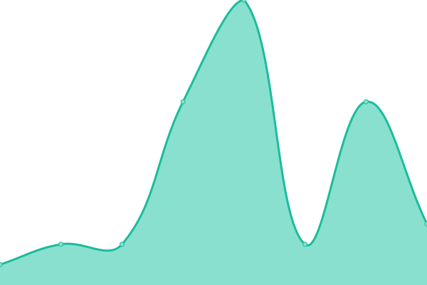
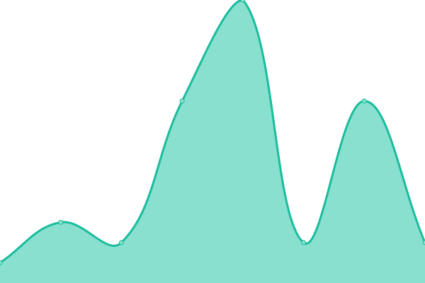
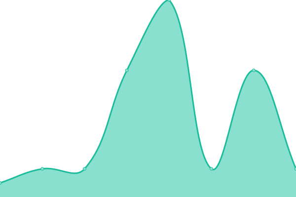
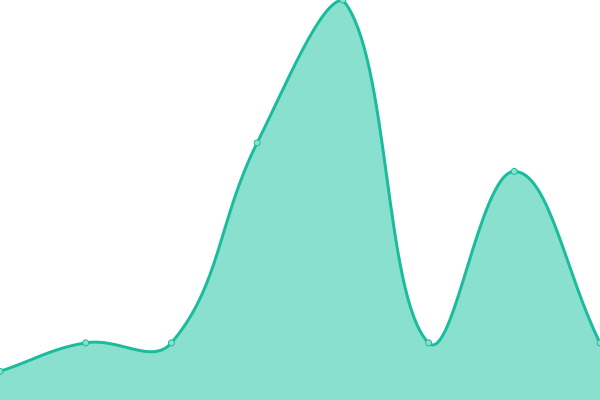

<!--start: status pages-->
<!-- This summary is generated by Upptime (https://github.com/upptime/upptime) -->
<!-- Do not edit this manually, your changes will be overwritten -->
<!-- prettier-ignore -->
| URL | Status | History | Response Time | Uptime |
| --- | ------ | ------- | ------------- | ------ |
|  [Cloudflare 1.1.1.1](1.1.1.1) | 🟩 Up | [cloudflare-1-1-1-1.yml](https://github.com/razinj/status-public/commits/HEAD/history/cloudflare-1-1-1-1.yml) | 

 8ms
     
 | 

<a href="https://razinj.github.io/status-public/history/cloudflare-1-1-1-1">100.00%</a>
    

|  [Cloudflare 1.0.0.1](1.0.0.1) | 🟩 Up | [cloudflare-1-0-0-1.yml](https://github.com/razinj/status-public/commits/HEAD/history/cloudflare-1-0-0-1.yml) | 

 8ms
     
 | 

<a href="https://razinj.github.io/status-public/history/cloudflare-1-0-0-1">100.00%</a>
    

|  [Cloudflare 1.1.1.2](1.1.1.2) | 🟩 Up | [cloudflare-1-1-1-2.yml](https://github.com/razinj/status-public/commits/HEAD/history/cloudflare-1-1-1-2.yml) | 

 8ms
     
 | 

<a href="https://razinj.github.io/status-public/history/cloudflare-1-1-1-2">100.00%</a>
    

|  [Cloudflare 1.0.0.2](1.0.0.2) | 🟩 Up | [cloudflare-1-0-0-2.yml](https://github.com/razinj/status-public/commits/HEAD/history/cloudflare-1-0-0-2.yml) | 

 8ms
     
 | 

<a href="https://razinj.github.io/status-public/history/cloudflare-1-0-0-2">100.00%</a>
    

|  [Cloudflare 1.1.1.3](1.1.1.3) | 🟩 Up | [cloudflare-1-1-1-3.yml](https://github.com/razinj/status-public/commits/HEAD/history/cloudflare-1-1-1-3.yml) | 

 8ms
     
 | 

<a href="https://razinj.github.io/status-public/history/cloudflare-1-1-1-3">100.00%</a>
    

|  [Cloudflare 1.0.0.3](1.0.0.3) | 🟩 Up | [cloudflare-1-0-0-3.yml](https://github.com/razinj/status-public/commits/HEAD/history/cloudflare-1-0-0-3.yml) | 

 8ms
     
 | 

<a href="https://razinj.github.io/status-public/history/cloudflare-1-0-0-3">100.00%</a>
    

<!--end: status pages-->
